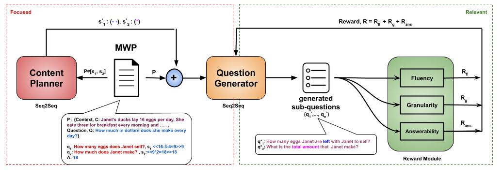
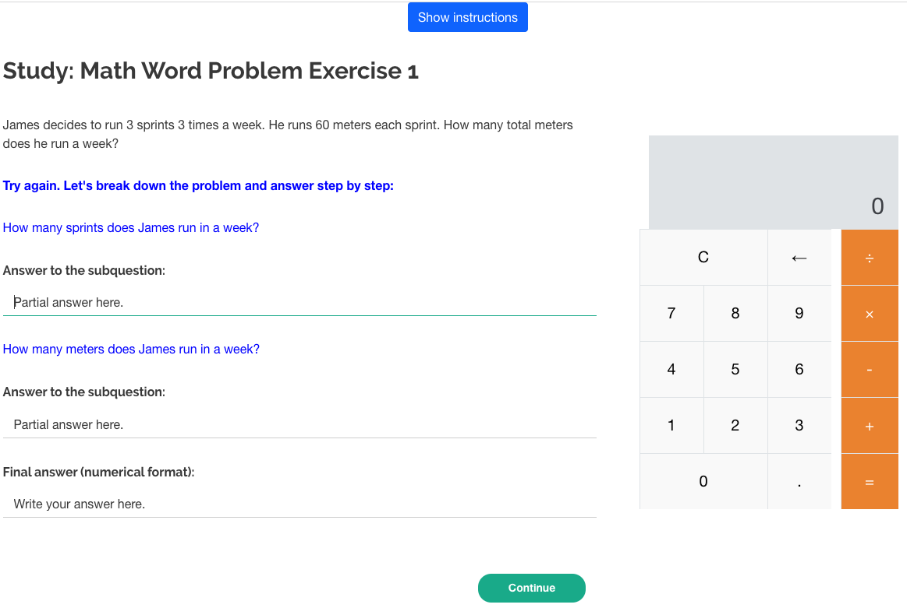

# Automatic Generation of Scaffolding (Socratic) Subquestions for Teaching Math Word Problems

This repository contains code of the paper:

### [Automatic Generation of Socratic Subquestions for Teaching Math Word Problems](https://arxiv.org/abs/2211.12835) (Accepted at EMNLP 2022).  
#### _Kumar Shridhar*, Jakub Macina*, Mennatallah El-Assady, Tanmay Sinha, Manu Kapur and Mrinmaya Sachan_
---

We explore the ability of large language models (LMs) in generating sequential questions for guiding math word problem-solving. We propose various guided question generation schemes based on input conditioning and reinforcement learning and found that on both automatic and human quality evaluations, LMs constrained with desirable question properties generate superior questions and improve the overall performance of a math word problem solver.

All experiments are performed on [GSM8K Dataset](https://github.com/openai/grade-school-math).



## Citation
Please cite as:
```bibtex
@inproceedings{shridhar-macina-2022-scaffolding-generation,
    title = "Automatic Generation of Scaffolding Questions for Learning Math",
    author = "Shridhar, Kumar and
    Macina, Jakub and
    El-Assady, Mennatallah and
    Sinha, Tanmay and
    Kapur, Manu and
    Sachan, Mrinmaya",
    booktitle = "Proceedings of the 2022 Conference on Empirical Methods in Natural Language Processing (EMNLP)",
    year = "2022",
    publisher = "Association for Computational Linguistics",
}
```

## User study
- User study contains of html for both groups with user study and post-test evaluation, qualification script for selecting participants
- See `treatment_group.html` for the user interface with generated questions as hints
- See `control_group.html` for the user interface without questions


Control group

Treatment group

## Camera ready version of the paper and the code is coming soon!

<a rel="license" href="http://creativecommons.org/licenses/by/4.0/"></a><br /><span xmlns:dct="http://purl.org/dc/terms/" href="http://purl.org/dc/dcmitype/Dataset" property="dct:title" rel="dct:type">Our work</span> is licensed under a <a rel="license" href="http://creativecommons.org/licenses/by/4.0/">Creative Commons Attribution 4.0 International License</a>.
